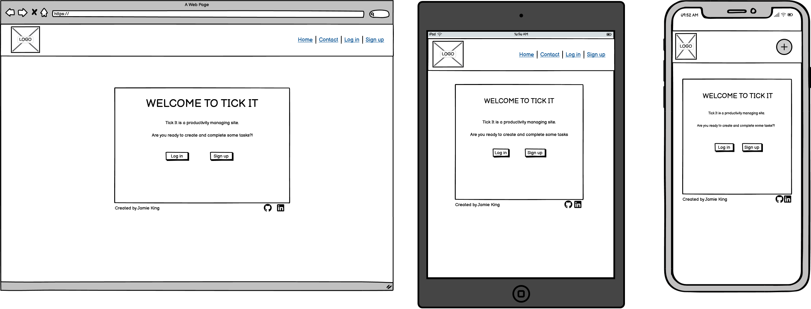
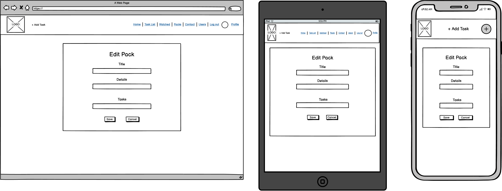

# Tick It
Developer: Jamie King

The Tick It........ 

[View live website](https://tick-it-app-pp5.herokuapp.com/)

## Table of Contents
  - [About](#about)
  - [Project Goals](#project-goals)
  - [User Stories](#user-stories)
  - [Design](#design)
    - [Colours](#colours)
    - [Fonts](#fonts)
    - [Wireframes](#wireframes)
  - [Technologies Used](#technologies-used)
    - [Languages](#languages)
    - [Libraries, frameworks and dependencies](#libraries-frameworks-and-dependencies)
    - [Tools & Programs](#tools--programs)
  - [Front-End](#front-end)
  - [Back-End API](#back-end-api)
  - [Features](#features)
  - [Future features / improvements](#future-features--improvements)
  - [Validation](#validation)
  - [Testing](#testing)
    - [Manual testing of user stories](#manual-testing-of-user-stories)
    - [Performing tests on various devices](#performing-tests-on-various-devices)
    - [Browser compatibility](#browser-compatibility)
  - [Bugs](#bugs)
  - [Config](#config)
  - [Credits](#credits)

## About

## Project Goals

The goal for this project was to build a platform to .

The key functionality aspects:
- user authentication

## User Stories

#### Navigation 

1. As a user, I can 
 
#### Authentication 

1. As a new user, I can 
1. As a returning user, I can 
1. As a user, I can maintain my logged-in status until I choose to log out so that my use of app is not compromised 

#### Tasks 

1. As a user, I can 

#### The Pack Page 

1. As a user, I can 

#### Main page 

1. As a user, I can 

#### User Profile Page 

1. As a user, I can add 

#### Other Users Profiles 

1. As a user, I can 

#### General

1. As a site owner I want my site to be 

##### Back to [top](#tick-it)

## Design

### Colours

The colour scheme for this application was inspired by 

### Fonts

Google Fonts were implemented on the website. 

### Wireframes

Balsamiq was used to create wireframes of the sites pages

Wireframes

##### Back to [top](#tick-it)

## Technologies Used

### Languages

- HTML
- CSS
- Javascript
  - React (17.0.2)

### Libraries, frameworks and dependencies

- [Axios](https://axios-http.com/docs/intro) - axios were used for promise-based HTTP. Justification: I used axios to send API requests from the React project to the API and avoid any CORS errors when sending cookies.
- [JWT](https://jwt.io/) - library to decode out JSON Web token. Justification: I used JWT to  from the browser when the user refreshes token expires or the user logs out.
- [React 17](https://17.reactjs.org/) - JavaScript library for building user interfaces
- [React-Bootstrap 2.7.2](https://) - Justification: I used Bootstrap React library for UI components, styling and responsiveness.
- [React Infinite Scroll](https://www.npmjs.com/package/react-infinite-scroll-component) - Justification: I used this component to load content (tasks/comments) automatically as the user scrolls towards the bottom of the page without having to jump to next/previous page.
- [React Router](https://v5.reactrouter.com/web/guides/quick-start) - used for dynamic routing. Justification: I used this library to 

### Tools & Programs

- [Am I Responsive](http://ami.responsivedesign.is/) was used to create the multi-device mock-up at the top of this README.md file
- [Balsamiq](https://balsamiq.com/) to create the projects wireframes
- [Chrome dev tools](https://developers.google.com/web/tools/chrome-devtools/) was used for debugging of the code and checking site for responsiveness
- [Cloudinary](https://cloudinary.com/) to store static files
- [Font Awesome](https://fontawesome.com/) - Icons from Font Awesome were used throughout the site
- [Google Fonts](https://fonts.google.com/) - import of Inter font
- [Git](https://git-scm.com/) was used for version control within VSCode to push the code to GitHub
- [GitHub](https://github.com/) was used as a remote repository to store project code
- [Gitpod](https://gitpod.io) was used to host a virtual workspace
- Validation:
  - [WC3 Validator](https://validator.w3.org/) was used to validate the applications html
  - [Jigsaw W3 Validator](https://jigsaw.w3.org/css-validator/) was used to validate the applications css
  - [ESLint](https://eslint.org/) used to validate applications JSX code
  - [Lighthouse](https://developers.google.com/web/tools/lighthouse/) used to validate performance, accessibility, best practice and SEO of the application
  - [Wave](https://wave.webaim.org/) - used to evaluate the applications accessibility

##### Back to [top](#tick-it)

## Front-End

### React

React is..... 

I used React for this application for several reasons:
- xxx - xxxx

There were various components created and reused across this application.

- `<Asset />` - resuable component, used to ...

- `<Asset />` - resuable component, used to ...

## Back-End API

### Django REST Framework

The API for this Front-End application was built with the Django REST Framework. The repository with a README file for the DRF Back-End can be found [here](https://github.com/jkingportfolio/CI_PP5_Tick_It_drf_api).

##### Back to [top](#tick-it)

## Features

### Feature name
- Includes 
- Contains direct links to 
- User stories covered: 1, 3

See feature screenshot

## Future features / improvements

Example of potential improvements to this project:

- Feature category
  - Additional feature description
  - Forgotten password option to recover access to the account via email
  - Allow user authentication with already existing accounts, e.g. LinkedIn, Google, etc. 
- Feature category
  - Additional feature description

##### Back to [top](#tick-it)

## Validation 

### HTML
The W3C Markup Validation Service was used to validate the HTML of the website. No errors were identified. 

Main page
 
 

 

Signup page
 
 

Login page
 
 

Task page

### CSS

The W3C Jigsaw CSS Validation Service was used to validate the CSS of the website. All CSS modules pass the validation with no errors.

App.module.css
 
 

 

### JSX
The JSX code was validated using the ESLint utility.

Eslint validation for components
 
 

 

Eslint validation for contexts
 
 

 

Eslint validation for hooks
 
 

 

Eslint validation for all pages
 
 

 

### Chrome Dev Tools Lighthouse 

Lighthouse was used to test the performance, accessibility, best practice and SEO of the site. The validation was done for both desktop & mobile.  

#### Desktop 

page
 
 

 

#### Mobile 

page
 
 

 

### Wave
The WAVE WebAIM web accessibility evaluation tool was used to test the websites accessibility.
There were a few errors related to missing labels and contrast issues on buttons. These errors were rectified.

Landing page

##### Back to [top](#tick-it)

## Testing
 
### Manual testing of user stories

1. As a user, I can 

**Step** | **Expected Result** | **Actual Result**
------------ | ------------ | ------------ |
 |  | Works as expected |
 

Screenshot

### Performing tests on various devices

The website was tested using 

The website was tested on the following devices:
- Device one
- Device two

### Browser compatibility

Testing has been carried out on the following browsers:
- Googe Chrome, version xxx.xxx.xxx.xxx

##### Back to [top](#tick-it)

## Bugs

| **Bug** | **Fix** |
| ------- | ------- |
|  |  |

##### Back to [top](#tick-it)

## Config

### Forking the GitHub Repository

We can make a copy of the original repository on our GitHub account to view or make changes too without affecting the original repository, this is known as forking. Forking in GitHub can be done via the following steps:

1. Navigate to www.github.com and log in.
2. Once logged in navigate to the desired [GitHub Repository](https://github.com/jkingportfolio/ci_pp5_tick_it_react) that you would like to fork.
3. At the top right corner of the page click on the fork icon.
4. There should now be a copy of your original repository in your GitHub account.

Please note if you are not a member of an organisation on GitHub then you will not be able to fork your own repository.
   
### Clone a GitHub Repository

You can make a local clone of a repository via the following steps: 

1. Navigate to www.github.com and log in.
2. Once logged in navigate to the desired [GitHub Repository](https://github.com/jkingportfolio/ci_pp5_tick_it_react) that you would like to clone.
3. Locate the code button at the top, above the repository file structure.
4. Select the preferred clone method from HTTPS. SSH or GitHub CLI then click the copy button to copy the URL to your clipboard.
5. Open Git Bash
6. Update the current working direction to the location in which you would like the clone directory to be created.
7. Type `git clone` and paste the previously copied URL at Step 4.
8. `$ clone https://github.com/jkingportfolio/ci_pp5_tick_it_react`
9. Now press enter and the local clone will be created at the desired local location

##### Back to [top](#tick-it)

## Credits

### Tutorials

- Real Python Django redirects tutorial - [The Ultimate Guide to Django Redirects](https://realpython.com/django-redirects/)

### Code

 Code from external sources were used as a basis and built on top of in this project, they are credited below:

 - 

### Literature

The use of reference books were used throughout the creation of this project and are credited below:

- Title - Author, published by 

### Misc

The source of where I learned how to produce a GitHub fork and clone was from the following pages of the GitHub Documentation. Although I did not use a fork or clone in this project it is something I hope to implement to future projects now I have the knowledge to do so.

- https://docs.github.com/en/get-started/quickstart/fork-a-repo
- https://docs.github.com/en/repositories/creating-and-managing-repositories/cloning-a-repository

Some images were used in this site and are credited below

- [Image](link) image on xxxxx page -  by [Owner](link)

## Acknowledgements

I would like to also thank the following:
- My wife and family for their support and feedback whilst doing this project
- Code Institute tutor support who helped with the many issues I had during this project.
- My Code Institute mentor Mo Shami for his guidance through this project.

[Back to Top](#tick-it)