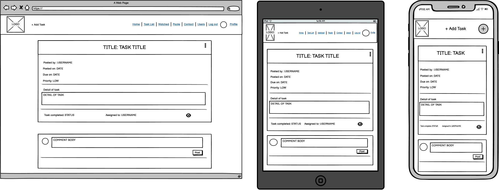
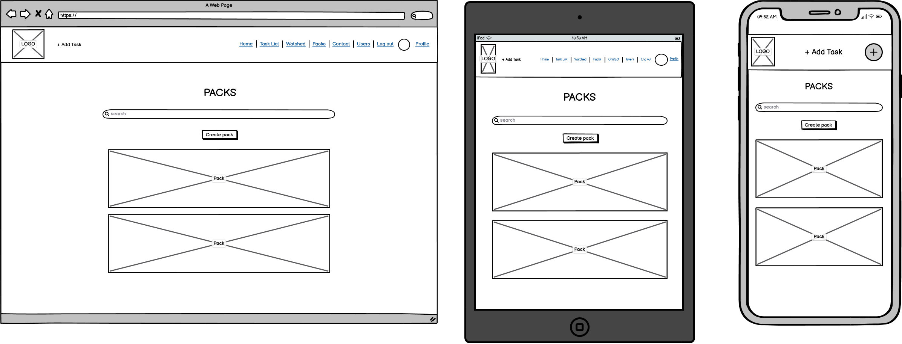
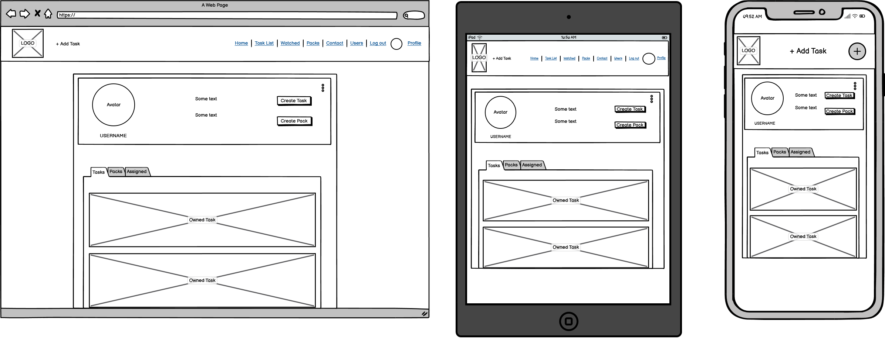
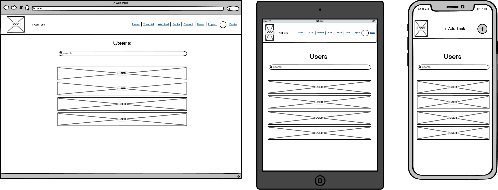
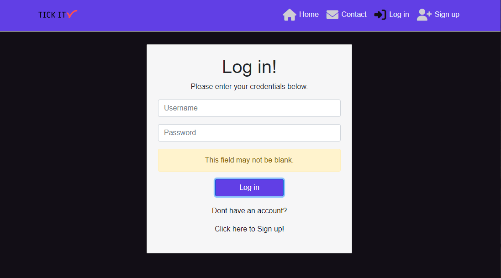

# Tick It
Developer: Jamie King

[View live website](https://tick-it-app-pp5.herokuapp.com/)

## Table of Contents
  1. [About](#about)
  2. [Project Goals](#project-goals)
  3. [User Experience](#user-experience)
    1. [Target Audience](#target-audience)
    2. [User Requirements and Expectations](#user-requirements-and-expectations)
    3. [User Stories](#user-stories)
    4. [Site Owner Stories](#site-owner-stories)
  4. [Technical Design](#technical-design)
    1. [Agile Design](#agile-design)
    2. [CRUD Functionality](#crud-functionality)
    3. [Colours](#colours)
    4. [Fonts](#fonts)
    5. [Wireframes](#wireframes)
  5. [Technologies Used](#technologies-used)
    - [Coding Languages](#coding-languages)
    - [Frameworks and Tools](#frameworks-and-tools)
    - [Libraries](#libraries)
  6. [Front-End](#front-end)
    1. [React](#react)
  7. [Back-End API](#back-end-api)
    1. [Django REST Framework](#django-rest-framework)
  8. [Features](#features)
  9. [Future features / improvements](#future-features--improvements)
  10. [Validation](#validation)
    1. [HTML](#html-validation)
    2. [CSS](#css-validation)
    3. [JSX](#jsx-validation)
    4. [Chrome Dev Tools Lighthouse](#chrome-dev-tools-lighthouse-validation)
    5. [WAVE Validation](#wave-validation)
  11. [Testing](#testing)
    1. [Device Testing](#device-testing)
    2. [Browser Compatibility](#browser-compatibility)
    3. [Manual Testing](#manual-testing)
    4. [Automated Testing](#automated-testing)
  12. [Bugs](#bugs)
  13. [Deployment](#deployment)
    1. [Heroku](#heroku)
    2. [Forking GitHub Repo](#forking-the-github-repository)
    3. [Clone a GitHub Repo](#clone-a-github-repository)
  14. [Credits](#credits)
    1. [Tutorial](#tutorials)
    2. [Code](#code)
    3. [Literature](#literature)
    4. [Misc](#misc)
  15. [Acknowledgements](#acknowledgements)

## About

The Tick It web app has been developed to provide user's the chance to create and carry out tasks online.

## Project Goals

The goal for this project was to build a productivity platform in which users can create tasks where other users who feel they can help, can carry out the work as described in the task detail. Tasks can be assigned to members and packs can also be created to group tasks together.

The key functionality aspects:

- The site to have be simple and use intuitive navigation across all pages
- User authentication
- User interaction via tasks, comments and packs
- User's to have their own profiles with brief description, profile image and tab group consisting of their owned tasks, packs and other users tasks which they have been assigned
- CRUD functionality for task, comments, packs and their profile
- Tasks filtering by keyword search, new tasks and high priority tasks
- Responsiveness to allow pleasant usage of the app across a range of devices woth varying display sizes

## User Experience

### Target Audience

- People who would like help with completing a task
- People who would like to keep track of outstanding tasks they may have
- People who are looking for some tasks to help others with

### User Requirements and Expectations

- A great site which provides a high level of interactiveness between users
- Links and functions to act as expected
- Notification to provide feedback on expected function outcomes
- Simple "to the point" content that a user can easily digest
- Accessibility for impaired users
- Responsiveness to allow pleasant use across devices of different screen sizes 

### User Stories

1. As a new user, I can register an account with Tick It so that I can become a member and use the app as intended.
2. As a user, I can use the navigation bar so that I can seamlessly navigate around the app.
3. As a user, I can see visual indicators for example of having watched / unwatched a task so that I can tell what my status of watching is.
4. As a user, I can watch and unwatch tasks so that I can keep up to date with that particular task via a filtered list.
5. As a user, I can view a list of my watched tasks so that I can focus on content I wish to view.
6. As a user, I can use the search bar on the Task list section so that I can find particular tasks easier.
7. As a user, I can delete my tasks so that I can permanently remove tasks I do not wish to keep.
8. As a user, I can edit my tasks so that I can correct spelling mistakes or I may have entered into the task information fields.
9. As a user, I can view task comments so that I can obtain more information on the task in question.
10. As a user, I can comment on other tasks so that I can interact with other users.
11. As a user, I can edit or delete my comment on a task incase of input error.
12. As a user, I can manage my tasks so that I can add, edit or delete posts as needed.
13. As a user, I can request a password so that I can log back into my account if I have forgotten my password.
14. As a user, I can log in so that I can access my account, view my profile, tasks and other user's tasks.
15. As a user, I can log out so that other users using the same device cannot access my account.
16. As a user, I can have a profile page so that I and other users can view my list of tasks, packs and assigned tasks.
17. As a user, I can update my profile so that my profile can stay up to date with my latest information.
18. As a user, I can add a profile picture so that other members can easily recognize my tasks or comments.
19. As a user, I can view the Home Page so that I can understand what the website is about, create an account or log in.
20. As a user, I can display basic info on my profile page so that other members can learn more about me.
21. As a user, I can search for tasks via a task bar so that I can specific tasks based on those keywords.
22. As a user, I can fill in a contact form so that I can enquire about issues I may have regarding the app.
23. As a user, I can receive feedback so that I can confirm whether the contact form submission was successful or not.
24. As a user, I can scroll through the latest tasks on the app so that I can find new tasks to complete.
25. As a user, I can browse a list of user accounts so that I can view that particular account.

### Site Owner Stories

26. As the site owner, I would want to validate users' data entries on sign up so that users can create a log in which meets the requirements.
27. As the site owner, I would want to ensure only logged in users can post from their account and edit their profile so that data privacy is ensured.
28. As the site owner, I would want to have the ability to remove posts so that I can keep the app clean and friendly.
29. As the site owner, I would want the site to be fully responsive so that users can use it across multiple devices and create a good user experience.
30. As the site owner, I would want to use the app search function so that I can search for particular tasks by their title.
31. As the site owner, I would want 404 and 500 error pages so that users do not have to use the back navigation button if an error occurs.
 

##### Back to [top](#tick-it)

## Technical Design

### Agile Design

An Agile approach to creating this app has been applied. GitHub's projects was used to track user stories and implement ideas based on their level of importance for allowing use of the app with no loss of functionality or user experience. Three categories were created indicating their level of importance, those were:
- MUST HAVE
- SHOULD HAVE
- COULD HAVE

By using AGILE methodology in this project I was able to deliver a site which had all required functionality and some more. Due to the time limit on this project I was not able to incorporate all initial listed features, but this is where an AGILE approach is great for app design. The project displays this by having User stories in the Done section and the ones which decided to be left for future put in the future implementation.

The GitHub project can be found [here](https://github.com/users/jkingportfolio/projects/9)

### CRUD Functionality

Tick It handles data with full CRUD Functionality:
 
- Create -  Users can create, account, profile, tasks, comment, and watch objects.
- Read - Users can view the tasks of other users and also the profiles of these users.
- Update - Users can update their profile, password, posted tasks and watch status of tasks via the interactive forms and buttons on the site.
- Delete - Users can delete tasks, comments and watch objects via the interactive buttons on the site.

### Colours

The colour scheme for this application was kept minimal with a monochromatic theme kept in mind. 

Colours

### Fonts

Google Fonts were implemented on the website. 'Josefin Sans' with a back up of sans-serif was decided as the ideal font for the site.

### Wireframes

Balsamiq was used to create wireframes of the sites pages

Wireframes

##### Back to [top](#tick-it)

## Technologies Used

### Coding Languages

- HTML
- CSS
- Javascript
  - React (17.0.2)

### Frameworks and Tools

- [Axios](https://axios-http.com/docs/intro) - axios were used for promise-based HTTP. Justification: I used axios to send API requests from the React project to the API and avoid any CORS errors when sending cookies.
- [JWT](https://jwt.io/) - library to decode out JSON Web token. Justification: I used JWT to  from the browser when the user refreshes token expires or the user logs out.
- [React 17](https://17.reactjs.org/) - JavaScript library for building user interfaces
- [React-Bootstrap 1.6.3](https://) - Justification: I used Bootstrap React library for UI components, styling and responsiveness.
- [React Infinite Scroll](https://www.npmjs.com/package/react-infinite-scroll-component) - Justification: I used this component to load content (tasks/comments) automatically as the user scrolls towards the bottom of the page without having to jump to next/previous page.
- [React Router](https://v5.reactrouter.com/web/guides/quick-start) - Justification: I used this library to enable navigation between views of components and to have the ability to control what is presented to the user based on the URL they have accessed in the browser. 
- [React ChartJS2](https://react-chartjs-2.js.org/) - Justification: used for producing the doughnut chart on the main page. 
- [React Multi Select Component](https://www.npmjs.com/package/react-multi-select-component) - Justification: I used this component to have the ability to select multiple tasks to assign to a pack.

- [Am I Responsive](http://ami.responsivedesign.is/) was used to create the multi-device mock-up at the top of this README.md file
- [Balsamiq](https://balsamiq.com/) to create the projects wireframes
- [Chrome dev tools](https://developers.google.com/web/tools/chrome-devtools/) was used for debugging of the code and checking site for responsiveness
- [Cloudinary](https://cloudinary.com/) to store static files
- [Font Awesome](https://fontawesome.com/) - Icons from Font Awesome were used throughout the site
- [Google Fonts](https://fonts.google.com/) - import of Inter font
- [Git](https://git-scm.com/) was used for version control within VSCode to push the code to GitHub
- [GitHub](https://github.com/) was used as a remote repository to store project code
- [Gitpod](https://gitpod.io) was used to host a virtual workspace
- Validation:
  - [WC3 Validator](https://validator.w3.org/) was used to validate the applications html
  - [Jigsaw W3 Validator](https://jigsaw.w3.org/css-validator/) was used to validate the applications css
  - [ESLint](https://eslint.org/) used to validate applications JSX code
  - [Lighthouse](https://developers.google.com/web/tools/lighthouse/) used to validate performance, accessibility, best practice and SEO of the application
  - [Wave](https://wave.webaim.org/) - used to evaluate the applications accessibility

### Libraries

#### Installed Libraries

| Package       | Version        |
| ------------- | ------------- |
| lib | x.x.x |
| lib | x.x.x |
| lib | x.x.x |
| lib | x.x.x |
| lib | x.x.x |
| lib | x.x.x |

##### Back to [top](#tick-it)

## Front-End

### React

The React.js framework is an open-source JavaScript framework and library developed by Facebook. It's used for building interactive user interfaces and web applications quickly and efficiently with significantly less code than you would with vanilla JavaScript  

I used React for this application for several reasons:

 - Flexibility – Due to having a modular structure React code is easier to maintain compared to other front-end frameworks.

 - Speed – Creating sites/apps with React significantly increases the page loading speed as the entire page does not require to refresh and reload all components. Components are updated dynamically thus reducing the wait and load times, which affects user experience.

 - React Bootstrap - When used for styling and responsiveness React Bootstrap is a great choice as it comes with ready-to-use React built components thus taking away alot of need to create commonly used code from scratch.

- It is the most widely used library for developing social networking and media content applications - Sites such as Meta (formerly Facebook), Instagram, Netflix, Airbnb are all made with React.

- Reusability of components – Components can be created and re used throught the app with no need to re write code for the same features.

There were various components created and reused across this application.

- `<Asset />` - multi purpose component, used to display a range of items due to being passed props. Those include a loading gif, image with source and alt attribute or a message consisting of a paragraph.

  - User stories covered: xx, xx

- `<Avatar />` - resuable component, used to display the relevant user profile picture. This component uses props which can specify the source of the image and also its size, an example of this components re-use ability is the image size on the profile page being bigger than that of the one in the Nav Bar yet it is the same component and source image used.

  - User stories covered: xx, xx

- `<DropDown />` - resuable component, used to display the three dots option button based on the required rights of the user and the item in question for example if a user is on their own profile the drop down to edit the profile will appear, however this will not be the case when viewing other users profile pages.

  - User stories covered: xx, xx

- `<FeedBackMsg />` - resuable component, used to display a bootstrap alart based on the message prop it has been provided. 

  - User stories covered: xx, xx

- `<HighPriorityTasks />` - specific component, used to display a filtered result of all task with the priority status of HIGH.

  - User stories covered: xx, xx

- `<NavBar />` - resuable component, used for easy navigation of the site. This component is re usable as it will display different icons based on a users logged in status. If no user is logged in a log in, sign up and contact icon will be available however if a user is currently logged in, the full range of icons will be available apart from log in.

  - User stories covered: xx, xx

- `<PageNotFound />` - specific component, used to display a 404 page made up of an image file and return home button for when the page does not exist.

  - User stories covered: xx, xx

- `<PasswordCriteria />` - re-usable component, used to display the validation criteria needed for a valid password entry.

  - User stories covered: xx, xx

- `<ScrollToTop />` - specific component, used to produce a button that will show when the user reaches the bottom of the page, this will allow the user to quickly return to the top of the page without the need for scrolling.

  - User stories covered: xx, xx

- `<TaskCompleteFilter />` - specific component, used to display a filtered result of all task with the complete status of incomplete or in-progress.

  - User stories covered: xx, xx

- `<TaskDoughnutChart />` - specific component, used to display a doughnut chart of all tasks completion status providing an easy visual indication of the tasks status.

  - User stories covered: xx, xx

- `<TaskStatusTable />` - specific component, used to display a numbered table of all tasks completion status providing an easy visual indication of the tasks status.

  - User stories covered: xx, xx

## Back-End API

### Django REST Framework

The API for this Front-End application was built with the Django REST Framework. The repository with a README file for the DRF Back-End can be found [here](https://github.com/jkingportfolio/CI_PP5_Tick_It_drf_api).

##### Back to [top](#tick-it)

## Features

In its entirety the website consists of a variety of features across the many site pages as listed below.

### Authentication

Authentication is a feature of the Tick It site, users will have to be authenticated whilst attempting to log in or else they will not be able to use any functionality of the site or view any information that Tick It users have posted.

Authentication image

- Covered in user stories: 1, 14, 27

### Log In

Log in is a feature of the Tick It site, 

Log In image

- Covered in user stories: 14

### Log Out

Log Out is a feature of the Tick It site, users will have 

Log Out image

- Covered in user stories: 15

### Sign Up

Sign Up is a feature of the Tick It site, users will have 

Sign Up image

- Covered in user stories: 1

### Home page

Home page is a feature of the Tick It site, users will have 

Home page image

- Covered in user stories: 19

### Nav Bar

Nav Bar is a feature of the Tick It site, users will have 

Nav Bar image

- Covered in user stories: 2

### Profile Section

Profile Section is a feature of the Tick It site, users will have 

Profile Section image

- Covered in user stories: 16

### Edit Profile

Edit Profile is a feature of the Tick It site, users will have 

Edit Profile image

- Covered in user stories: 17 & 18

### Change Password

Change Password is a feature of the Tick It site, users will have 

Change Password image

- Covered in user stories: 13

### Create task

Create task is a feature of the Tick It site, users will have 

Create task image

- Covered in user stories: 12

### Delete task

Delete task is a feature of the Tick It site, users will have 

Delete task image

- Covered in user stories: 7, 12, 28

### Edit task

Edit task is a feature of the Tick It site, users will have 

Edit task image

- Covered in user stories: 8, 12

### Task comment

Task comment is a feature of the Tick It site, users will have 

Task comment image

- Covered in user stories: 9

### Create task comment

Create task comment is a feature of the Tick It site, users will have 

Create task comment image

- Covered in user stories: 10

### Edit task comment

Edit task comment is a feature of the Tick It site, users will have 

Edit task comment image

- Covered in user stories: 11

### Delete task comment

Delete task comment is a feature of the Tick It site, users will have 

Delete task comment image

- Covered in user stories: 11, 28

### Task list

Task list is a feature of the Tick It site, users will have 

Task list image

- Covered in user stories: 21, 24

### Task Search

Task Search is a feature of the Tick It site, users will have 

Task Search image

- Covered in user stories: 21, 30

### Watch / Unwatch task

Watch / Unwatch task is a feature of the Tick It site, users will have 

Watch / Unwatch task image

- Covered in user stories: 4

### Watch / Unwatch button

Watch / Unwatch button is a feature of the Tick It site, users will have 

Watch / Unwatch button image

- Covered in user stories: 3, 4

### Watched list

Watched list is a feature of the Tick It site, users will have 

Watched list image

- Covered in user stories: 5

### Input Validation

Input Validation is a feature of the Tick It site, users will have 

Input Validation image

- Covered in user stories: 1, 14, 26

### Task Count

Task Count is a feature of the Tick It site, users will have 

Task Count image

- Covered in user stories: 17

### Create Pack

Create Pack is a feature of the Tick It site, users will have 

Create Pack image

- Covered in user stories: ??

### Edit Pack

Edit Pack is a feature of the Tick It site, users will have 

Edit Pack image

- Covered in user stories: ??

### Delete Pack

Delete Pack is a feature of the Tick It site, users will have 

Delete Pack image

- Covered in user stories: ??

### Responsiveness

Responsiveness is a feature of the Tick It site, users will have 

Responsiveness image

- Covered in user stories: 29

### Search Bar

Search Bar is a feature of the Tick It site, users will have 

Search Bar image

- Covered in user stories: 29

### Contact

Contact is a feature of the Tick It site, users will have 

Contact image

- Covered in user stories: 22

### Error pages

Error pages is a feature of the Tick It site, users will have 

Error pages image

- Covered in user stories: 31

### Site Feedback

Site Feedback is a feature of the Tick It site, users will have 

Site Feedback image

- Covered in user stories: 23

### Users list

Users list is a feature of the Tick It site, users will have 

Users list image

- Covered in user stories: 25

## Future features / improvements

Although alot of effort was put into this project, due to time constraints there is still room for finer refactoring of code and additional functionality / features to implement to the site. 

- Password recovery
  - Forgotten password option to recover access to the account via email
- Account creation via socials
  - Allow user authentication with already existing accounts, e.g. LinkedIn, Google, etc. 
- A notifications feature
  - A feature to have notifications related to tasks you are invovled in / own and if their completion status has been updated.

##### Back to [top](#tick-it)

## Validation 

### HTML Validation

The W3C Markup Validation Service was used to validate the HTML of the website. No errors were identified. 

Main page (not logged in)
 
 

Main page (logged in user)
 
 

 

Signup page
 
 

Login page
 
 

Tasks page

Task create page

Task detail page

Watched page

Pack page

Pack create page

Pack detail page

Contact page

Users page

Profile page

404 page

### CSS Validation

The W3C Jigsaw CSS Validation Service was used to validate the CSS of the website. All CSS modules pass the validation with no errors.

App.module.css
 
 

 

Asset.module.css
 
 

Avatar.module.css
 
 

Comment.module.css
 
 

CommentForm.module.css
 
 

CredentialsForm.module.css
 
 

Dashboard.module.css
 
 

DropdDown.module.css
 
 

FeedBackMsg.module.css
 
 

LandingPage.module.css
 
 

NavBar.module.css
 
 

Pack.module.css
 
 

PackCreateEditForm.module.css
 
 

PackListings.module.css
 
 

ProfilePage.module.css
 
 

ScrollToTop.module.css
 
 

SearchBar.module.css
 
 

Task.module.css
 
 

TaskListings.module.css
 
 

UserProfiles.module.css
 
 

### JSX Validation 

The JSX code was validated using the ESLint utility.

Eslint validation for components
 
 

 

Eslint validation for contexts
 
 

 

Eslint validation for hooks
 
 

 

Eslint validation for all pages
 
 

 

### Chrome Dev Tools Lighthouse Validation

Lighthouse was used to test the performance, accessibility, best practice and SEO of the site. The validation was done for both desktop & mobile.  

#### Desktop 

Landing Page
 
 

 

Main Page
 
 

#### Mobile 

Landing Page
 
 

 

Main Page
 
 

 

### Wave Validation

The WAVE WebAIM web accessibility evaluation tool was used to test the websites accessibility.
There were a few errors related to missing labels and contrast issues on buttons. These errors were rectified.

Main page (not logged in)
 
 

Main page (logged in user)
 
 

 

Signup page
 
 

Login page
 
 

Tasks page

Task create page

Task detail page

Watched page

Pack page

Pack create page

Pack detail page

Contact page

Users page

Profile page

404 page

##### Back to [top](#tick-it)

## Testing

### Device Testing

This site was tested on the following devices:
- Windows 10 PC with a 24" MSI Curved gaming monitor
- Raspberry Pi 4 with a 24" MSI Curved gaming monitor
- Xiaomi Redmi Note 10 Pro

### Browser compatibility

The website was tested on the following web browsers:
- Google Chrome (Version 112.0.5615.121)
- DuckDuckGo
 
### Manual testing

See Testing User Stories

#### Testing User Stories - Users

To avoid unnecessary repetition of images, only the feature being referred to will have screenshots. Information on how to navigate to the feature referred to will be described within its relevant table reference. 

1. As a new user, I can register an account with Tick It so that I can become a member and use the app as intended. 

| Feature       | Action        | Expected Result  | Actual Result |
| ------------- | ------------- | -------------    | ------------- |
|    |   |   |  |

Screenshots

2. As a user, I can use the navigation bar so that I can seamlessly navigate around the app. 

| Feature       | Action        | Expected Result  | Actual Result |
| ------------- | ------------- | -------------    | ------------- |
|    |   |   |  |

Screenshots

3. As a user, I can see visual indicators for example of having watched / unwatched a task so that I can tell what my status of watching is.

| Feature       | Action        | Expected Result  | Actual Result |
| ------------- | ------------- | -------------    | ------------- |
|    |   |   |  |

Screenshots

4. As a user, I can watch and unwatch tasks so that I can keep up to date with that particular task via a filtered list. 

| Feature       | Action        | Expected Result  | Actual Result |
| ------------- | ------------- | -------------    | ------------- |
|    |   |   |  |

Screenshots

5. As a user, I can view a list of my watched tasks so that I can focus on content I wish to view. 

| Feature       | Action        | Expected Result  | Actual Result |
| ------------- | ------------- | -------------    | ------------- |
|    |   |   |  |

Screenshots

6. As a user, I can use the search bar on the Task list section so that I can find particular tasks easier. 

| Feature       | Action        | Expected Result  | Actual Result |
| ------------- | ------------- | -------------    | ------------- |
|    |   |   |  |

Screenshots

7. As a user, I can delete my tasks so that I can permanently remove tasks I do not wish to keep. 

| Feature       | Action        | Expected Result  | Actual Result |
| ------------- | ------------- | -------------    | ------------- |
|    |   |   |  |

Screenshots

8. As a user, I can edit my tasks so that I can correct spelling mistakes or I may have entered into the task information fields.

| Feature       | Action        | Expected Result  | Actual Result |
| ------------- | ------------- | -------------    | ------------- |
|    |   |   |  |

Screenshots

9. As a user, I can view task comments so that I can obtain more information on the task in question. 

| Feature       | Action        | Expected Result  | Actual Result |
| ------------- | ------------- | -------------    | ------------- |
|    |   |   |  |

Screenshots

10. As a user, I can comment on other tasks so that I can interact with other users. 

| Feature       | Action        | Expected Result  | Actual Result |
| ------------- | ------------- | -------------    | ------------- |
|    |   |   |  |

Screenshots

11. As a user, I can edit or delete my comment on a task incase of input error. 

| Feature       | Action        | Expected Result  | Actual Result |
| ------------- | ------------- | -------------    | ------------- |
|    |   |   |  |

Screenshots

12. As a user, I can manage my tasks so that I can add, edit or delete posts as needed. 

| Feature       | Action        | Expected Result  | Actual Result |
| ------------- | ------------- | -------------    | ------------- |
|    |   |   |  |

Screenshots

13. As a user, I can request a password so that I can log back into my account if I have forgotten my password. 

| Feature       | Action        | Expected Result  | Actual Result |
| ------------- | ------------- | -------------    | ------------- |
|    |   |   |  |

Screenshots

14. As a user, I can log in so that I can access my account, view my profile, tasks and other user's tasks. 

| Feature       | Action        | Expected Result  | Actual Result |
| ------------- | ------------- | -------------    | ------------- |
|    |   |   |  |

Screenshots

15. As a user, I can log out so that other users using the same device cannot access my account. 

| Feature       | Action        | Expected Result  | Actual Result |
| ------------- | ------------- | -------------    | ------------- |
|    |   |   |  |

Screenshots

16. As a user, I can have a profile page so that I and other users can view my list of tasks, packs and assigned tasks.

| Feature       | Action        | Expected Result  | Actual Result |
| ------------- | ------------- | -------------    | ------------- |
|    |   |   |  |

Screenshots

17. As a user, I can update my profile so that my profile can stay up to date with my latest information. 

| Feature       | Action        | Expected Result  | Actual Result |
| ------------- | ------------- | -------------    | ------------- |
|    |   |   |  |

Screenshots

18. As a user, I can add a profile picture so that other members can easily recognize my tasks or comments.

| Feature       | Action        | Expected Result  | Actual Result |
| ------------- | ------------- | -------------    | ------------- |
|    |   |   |  |

Screenshots

19. As a user, I can view the Home Page so that I can understand what the website is about, create an account or log in. 

| Feature       | Action        | Expected Result  | Actual Result |
| ------------- | ------------- | -------------    | ------------- |
|    |   |   |  |

Screenshots

20. As a user, I can display basic info on my profile page so that other members can learn more about me. 

| Feature       | Action        | Expected Result  | Actual Result |
| ------------- | ------------- | -------------    | ------------- |
|    |   |   |  |

Screenshots

21. As a user, I can search for tasks via a task bar so that I can specific tasks based on those keywords. 

| Feature       | Action        | Expected Result  | Actual Result |
| ------------- | ------------- | -------------    | ------------- |
|    |   |   |  |

Screenshots

22. As a user, I can fill in a contact form so that I can enquire about issues I may have regarding the app. 

| Feature       | Action        | Expected Result  | Actual Result |
| ------------- | ------------- | -------------    | ------------- |
|    |   |   |  |

Screenshots

23. As a user, I can receive feedback so that I can confirm whether the contact form submission was successful or not.

| Feature       | Action        | Expected Result  | Actual Result |
| ------------- | ------------- | -------------    | ------------- |
|    |   |   |  |

Screenshots

24. As a user, I can scroll through the latest tasks on the app so that I can find new tasks to complete.

| Feature       | Action        | Expected Result  | Actual Result |
| ------------- | ------------- | -------------    | ------------- |
|    |   |   |  |

Screenshots

25. As a user, I can browse a list of user accounts so that I can view that particular account. 

| Feature       | Action        | Expected Result  | Actual Result |
| ------------- | ------------- | -------------    | ------------- |
|    |   |   |  |

Screenshots

#### Testing User Stories - Site Owner

26. As the site owner, I would want to validate users' data entries on sign up so that users can create a log in which meets the requirements.

| Feature       | Action        | Expected Result  | Actual Result |
| ------------- | ------------- | -------------    | ------------- |
|    |   |   |  |

Screenshots

27. As the site owner, I would want to ensure only logged in users can post from their account and edit their profile so that data privacy is ensured. 

| Feature       | Action        | Expected Result  | Actual Result |
| ------------- | ------------- | -------------    | ------------- |
|    |   |   |  |

Screenshots

28. As the site owner, I would want to have the ability to remove posts so that I can keep the app clean and friendly. 

| Feature       | Action        | Expected Result  | Actual Result |
| ------------- | ------------- | -------------    | ------------- |
|    |   |   |  |

Screenshots

29. As the site owner, I would want the site to be fully responsive so that users can use it across multiple devices and create a good user experience. 

| Feature       | Action        | Expected Result  | Actual Result |
| ------------- | ------------- | -------------    | ------------- |
|    |   |   |  |

Screenshots

30. As the site owner, I would want to use the app search function so that I can search for particular tasks by their title.

| Feature       | Action        | Expected Result  | Actual Result |
| ------------- | ------------- | -------------    | ------------- |
|    |   |   |  |

Screenshots

31. As the site owner, I would want 404 and 500 error pages so that users do not have to use the back navigation button if an error occurs.

| Feature       | Action        | Expected Result  | Actual Result |
| ------------- | ------------- | -------------    | ------------- |
|    |   |   |  |

Screenshots

### Automated testing

##### Back to [top](#tick-it)

## Bugs

| **Bug** | **Fix** |
| ------- | ------- |
|  |  |

##### Back to [top](#tick-it)

## Deployment

### Heroku

This project was deployed to [Heroku](https://www.heroku.com) in the project's early stages to allow continual responsive testing. This was achieved via the following steps:

The website was deployed with Heroku by following these steps:

1. Use the "pip freeze -> requiremnts.txt" command in the terminal to save any libraries that need to be installed in the file.
2. The app uses Cloudinary to host the post images therefore a Cloudinary account will be required. 
3. Log in to [Cloudinary](https://cloudinary.com/) or create an account for free.
4. Navigate to the Dashboard on Cloudinary

Screenshot

5. Copy and store the value of the 'API Environment Variable" beginning at cloudinary:// until the end, this will be used in the Heroku Config Vars. 
6. The app also uses ElephantSQL to host the database
7. Log in to [ElephantSQL](https://www.elephantsql.com/) or create an account for free.
8. Click on Create a new instance

Screenshot

9. Set up your plan. Give the 'plan' the desired name, select the Tiny Turtle (free) plan and leave tags blank.

Screenshot

10. Select the region and choose the nearest data centre to your location.

Screenshot

11. Click 'review' and if happy with the details presented click on the create instance button.

Screenshot

12. From the instances section click on the instance with the name that was just created.
13. Get the ElephantSQL database URL from the instance details page and copy, this will be used in the Heroku Config Vars

Screenshot

14. Navigate to https://www.heroku.com/ and login or create an account. 
15. Click the "new" button in the upper right corner and select "create new app".

Screenshot

16. Choose an app name and your region and click "Create app".

Screenshot

17. Reveal Config Vars and store the required config var names and values as below:

- `CLOUDINARY_URL`: *your Cloudinary URL as obtained above*
- `DATABASE_URL`: *your ElephantSQL postgres database URL as obtained above*
- `PORT`: `8000`
- `SECRET_KEY`: *your secret key*

Screenshot

18. Go to the "deploy" tab and pick GitHub as a deployment method.
19. Search for a repository to connect to and select the branch you would like to build the app from.
20. If preferred, enable automatic deploys and then deploy branch.
21. Wait for the app to build and then click on the "View" link which will redirect you to the deployed link.

### Forking the GitHub Repository

We can make a copy of the original repository on our GitHub account to view or make changes too without affecting the original repository, this is known as forking. Forking in GitHub can be done via the following steps:

1. Navigate to www.github.com and log in.
2. Once logged in navigate to the desired [GitHub Repository](https://github.com/jkingportfolio/ci_pp5_tick_it_react) that you would like to fork.
3. At the top right corner of the page click on the fork icon.
4. There should now be a copy of your original repository in your GitHub account.

Please note if you are not a member of an organisation on GitHub then you will not be able to fork your own repository.
   
### Clone a GitHub Repository

You can make a local clone of a repository via the following steps: 

1. Navigate to www.github.com and log in.
2. Once logged in navigate to the desired [GitHub Repository](https://github.com/jkingportfolio/ci_pp5_tick_it_react) that you would like to clone.
3. Locate the code button at the top, above the repository file structure.
4. Select the preferred clone method from HTTPS. SSH or GitHub CLI then click the copy button to copy the URL to your clipboard.
5. Open Git Bash
6. Update the current working direction to the location in which you would like the clone directory to be created.
7. Type `git clone` and paste the previously copied URL at Step 4.
8. `$ clone https://github.com/jkingportfolio/ci_pp5_tick_it_react`
9. Now press enter and the local clone will be created at the desired local location

##### Back to [top](#tick-it)

## Credits

### Tutorials

- Real Python Django redirects tutorial - [The Ultimate Guide to Django Redirects](https://realpython.com/django-redirects/)

### Code

 Code from external sources were used as a basis and built on top of in this project, they are credited below:

 - 

### Literature

The use of reference books were used throughout the creation of this project and are credited below:

- Title - Author, published by 

### Misc

The source of where I learned how to produce a GitHub fork and clone was from the following pages of the GitHub Documentation. Although I did not use a fork or clone in this project it is something I hope to implement to future projects now I have the knowledge to do so.

- https://docs.github.com/en/get-started/quickstart/fork-a-repo
- https://docs.github.com/en/repositories/creating-and-managing-repositories/cloning-a-repository

Some images were used in this site and are credited below

- [Image](link) image on xxxxx page -  by [Owner](link)

## Acknowledgements

I would like to also thank the following:
- My wife and family for their support and feedback whilst doing this project
- Code Institute tutor support who helped with the many issues I had during this project.
- My Code Institute mentor Mo Shami for his guidance through this project.

[Back to Top](#tick-it)